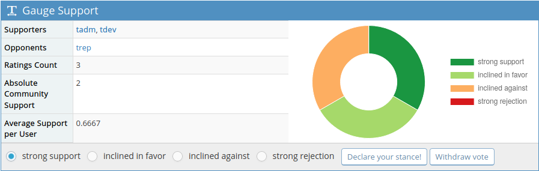

# Gauge Support plugin for MantisBT

Copyright (c) 2010 Charly Kiendl  
Copyright (c) 2017 Cas Nuy  
Copyright (c) 2019 Damien Regad

Released under the [GPL v3 license](http://opensource.org/licenses/GPL-3.0).

See the [Changelog](https://github.com/mantisbt-plugins/GaugeSupport/blob/master/CHANGELOG.md).

## Description

Allows users to vote on issues.

## Requirements

- MantisBT 2.0.0
- MantisGraph plugin 2.25.0 (optional, to display charts)

## Installation

1. [Download](https://github.com/mantisbt-plugins/GaugeSupport/releases/latest)
   the plugin's latest release from GitHub
2. Create a new directory `GaugeSupport` (case-sensitive) under MantisBT's 
   `/plugins` directory
3. Extract all files into the new directory
4. Go to _Manage / Manage Plugins_ and install the plugin
5. If you want to display voting statistics charts, make sure that the 
   _MantisGraph_ core plugin is installed 
6. [Configure](#Configuration) the plugin as appropriate

### Configuration

You can specify which issues the users will be able to vote on, based on the
following criteria:

- **Status**: by default, _resolved_ and _closed_ are excluded
- **Resolution**: by default, all resolutions except _open_, _reopened_ and
  _suspended_ are excluded 
- **Severity**: includes _feature_, _minor_, _major_, _crash_ and _block_
  by default

## Usage

### Voting

On the _View Issue Details page_, a new **Gauge Support section** is added,  
allowing users to :

- see who voted for (or against) the issue,
- review voting statistics, including a pie chart (if the MantisGraph plugin
  is installed), and
- cast their vote (with 2 levels of support or rejection, +2/+1/-1/-2) 
  or withdraw it.

### Reporting

A new **Issue Support Ranking** menu item is available in the sidebar.

It opens a report page, displaying a table listing all issues having received at 
least one Rating, sorted in descending order of the _Absolute Community Support_ 
(i.e. the sum of all Ratings for the issue). This means that the most popular 
issues will be at the top.

The Rankings data can be **exported to Excel** using the button in the header.

 
 

## Support

File bug reports and submit questions on the
[GitHub issues tracker](http://github.com/mantisbt-plugins/GaugeSupport/issues).

## Credits

This plugin is based on the [original version](https://github.com/EvilRenegade/Gauge-Support/)
written by Charly Kiendl (EvilRenegade) back in 2010. 

It was updated to work on MantisBT 2.x by Cas Nuy in 2017.

Damien Regad gave it a complete overhaul in 2019.
